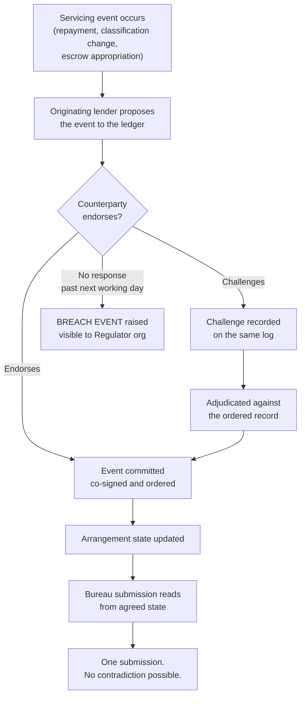

# Ekmat

**A shared event ledger for co-lending dispute adjudication, built on DRUNIX.**

*Ekmat* (एकमत) means "of one opinion." That is what the system produces: two lenders holding a single agreed position on one borrower's loan, instead of two contradictory ones.

> **Status:** Design and specification. Implementation begins with Phase 0 (see [WORKFLOW.md](docs/WORKFLOW.md)).
> Submitted to the DRUNIX Hackathon (NPCI × Citi × India Blockchain Forum), Problem Statement 4 — Financial Inclusion.

---

## The problem in eight lines

**Today — one loan, two lenders, two answers:**

```
   Bank's LMS  ──────────────────────►  Credit Bureau   "Standard"
                                              ⚠  CONFLICT
   NBFC's LMS  ──────────────────────►  Credit Bureau   "SMA-2"

                        The borrower's file now carries a dispute
                        they did not cause and cannot trace.
```

**With Ekmat — one loan, two lenders, one answer:**

```
   Bank's LMS  ──┐
                 ├──►  SHARED EVENT LEDGER  ──►  Credit Bureau   "SMA-2"
   NBFC's LMS  ──┘        (co-signed,              (one agreed position,
                           ordered,                 submitted once)
                           append-only)
```

Both lenders keep their own books. What they share is the **sequence of events** those books are derived from.

---

## Why this gap exists

The **Reserve Bank of India (Co-Lending Arrangements) Directions, 2025** — `RBI/DOR/2025-26/139`, issued 6 August 2025, effective 1 January 2026 — created a reconciliation surface and did not create anything to reconcile it on.

Four provisions, read together:

| Para | What it requires |
|------|------------------|
| **25** | Each lender maintains the borrower's account **individually**, for its own share |
| **26** | Every disbursement and repayment routes through an **escrow account** |
| **31** | Each lender reports to credit bureaus **separately**, for the same loan |
| **33** | Both must reach the **same SMA/NPA classification**, shared "on a near-real time basis, and in any case latest by end of the next working day" |

The Directions name **no lead lender and no system of record**. Nothing in the text says whose version of the loan's history is authoritative when the two diverge.

Para 13 requires a single point of interface with the *customer* — but that is a servicing obligation, not a shared ledger.

### And they do diverge

- The **IIBF** surveyed 16 banks and 20 NBFCs: partners run **different loan management systems**, take **one to two quarters** to integrate with each new partner, and IRAC vs Ind-AS divergence produces conflicting classification positions on the same exposure.
- **Prashant Kumar, MD & CEO, Yes Bank** (May 2025): *"I think everybody is struggling. Fundamentally, it means your underwriting standards should be aligned with those of the originator."*
- Executives at UGRO, Tyger Capital, Sa-Dhan, ICRA and Vivriti have raised inconsistent classification across partners on record.
- **Scale:** NBFC co-lending AUM crossed **₹1.1 lakh crore** at 31 March 2025, growing **35–40% annually** (CRISIL Ratings).

---

## How it works

### The event lifecycle



### The Para 33 convergence, step by step

```
  1  DIVERGENCE      NBFC moves the exposure to SMA-2.
                     Bank's own system still reads Standard.

  2  PROPOSAL        The transition is proposed to the shared ledger —
                     timestamped and signed, not emailed.

  3  ENDORSE         Bank endorses, or raises a challenge with its own
     OR CHALLENGE    evidence written to the same log.

  4  CONVERGENCE     The arrangement holds ONE classification.
                     Bureau submission reads from it.

     ⏱  The next-working-day deadline is enforced in contract logic.
        An unendorsed proposal past it raises a breach event.
```

---

## Network topology

Four organisations on one DRUNIX channel per arrangement:

```
    ┌─────────────────┐         ┌─────────────────┐
    │      BANK       │         │      NBFC       │
    │    endorser     │         │    endorser     │
    │                 │         │                 │
    │ own books/Para25│         │ own books/Para25│
    └────────┬────────┘         └────────┬────────┘
             │                           │
             │      dual endorsement     │
             └─────────────┬─────────────┘
                           ▼
        ┌──────────────────────────────────────┐
        │      SHARED EVENT LEDGER             │
        │   append-only · co-signed · ordered  │
        │        (DRUNIX channel)              │
        └──────────────────────────────────────┘
                     ▲             │
                     │             │ read-only
            ┌────────┴──────┐   ┌──▼──────────────┐
            │ ESCROW BANK   │   │   REGULATOR     │
            │ writes        │   │   observer      │
            │ settlement    │   │ reads directly, │
            │ events        │   │ no statements   │
            └───────────────┘   │ requested       │
                                └─────────────────┘
```

Full detail in [**ARCHITECTURE.md**](docs/ARCHITECTURE.md).

---

## Why DRUNIX

[DRUNIX](https://github.com/npci/drunix) is NPCI's open source distributed ledger, described in its own README as *"an enhanced fork of Hyperledger Fabric."*

| Requirement | How DRUNIX meets it |
|---|---|
| Known, contractual counterparty set | Permissioned MSP membership — not an open network |
| Neither party hosts the other's record | Dual endorsement policy at the chaincode level |
| Shared sequence without exposing wider books | Channels per arrangement + private data collections |
| Supervisor reads without requesting statements | Regulator org as a read-only network member |
| Written in a language I ship production code in | **Java chaincode** — verified in `core/chaincode/platforms`, where `SupportedPlatforms` contains a fully implemented `java.Platform{}` in v1.0.0 |

**Honest note on Java.** Java chaincode support is *inherited from Hyperledger Fabric*, not documented by NPCI, and every DRUNIX sample I found uses Go. **Phase 0 exists to retire that risk in two days**, with a Go fallback identified. The design does not depend on DRUNIX's Java-undemonstrated features (such as its SQL state database).

---

## The objection this project must answer

> **"Why not a signed append-only log in Postgres?"**

Fair, and worth raising rather than dodging. Much of this *would* work in a conventional database.

**The answer is custody, not cryptography.** A signed log in one party's database is still *that party's* log. A bank and an NBFC have opposed incentives on NPA timing and collection sequencing — which is exactly why neither should host the record the other is bound by.

**On why consortium ledgers died before.** we.trade, TradeLens, Marco Polo and Contour failed on getting *many* counterparties onto one platform, not on technology. A co-lending arrangement is **two parties with a pre-existing contract and a regulatory duty to agree**. That is a materially easier adoption problem, and it is why this use case was chosen rather than a broader one.

**What the ledger actually buys:** non-repudiable event *ordering*. When the two submit conflicting DPD, the dispute is whose timestamp was right. A co-signed append-only log makes that answerable by either party, without either owning it.

---

## Stack

| Layer | Technology |
|---|---|
| Distributed ledger | DRUNIX (NPCI), enhanced fork of Hyperledger Fabric — permissioned MSP, 4 orgs, channels per arrangement, private data collections, Raft ordering |
| Smart contract | Java chaincode |
| Application | Java 21, Spring Boot 3, REST APIs, RBAC, audit logging on every write |
| State & reporting | PostgreSQL, Liquibase migrations |
| Integrity | Hash-chained append-only event log, idempotent writes keyed by event reference, immutable audit storage |
| Frontend | Next.js 14 + TypeScript (arrangement dashboard) |
| Testing | JUnit 5, Mockito, concurrency tests with simultaneous submission, fault injection, chain verification as a test |
| Infrastructure | Docker, GitHub Actions CI/CD, Linux |

---

## Build phases

| Phase | Days | Deliverable | Done when |
|---|---|---|---|
| **0** | 1–2 | DRUNIX network + trivial Java chaincode | A Java contract commits and reads back on a multi-org network. If not, pivot to Go — two days lost, not two weeks. |
| **1** | 3–5 | 4 orgs, channel per arrangement, event schema | Each org reads the shared sequence; no org writes on another's behalf |
| **2** | 6–9 | Co-signed event append | A duplicated or replayed submission appends **exactly once** under concurrent load |
| **3** | 10–13 | Para 33 convergence state machine | Divergent classification rejected at the contract; unendorsed proposal past deadline raises a breach event |
| **4** | 14–16 | Bureau submission gated on agreed state | Two lenders cannot produce contradictory submissions; injected format rejection is tracked, not dropped |
| **5** | 17–20 | Dispute adjudication + demonstration | Full lifecycle end to end; adversarial suite passes against the integrated system |

Phase 2 is the critical correctness milestone and is scheduled early for that reason. Full detail in [**WORKFLOW.md**](docs/WORKFLOW.md).

---

## Prior work this builds on

**Regulatory reporting pipeline — already merged upstream.**
[CB-ILD](https://github.com/openMF), built inside openMF during a paid global internship with the Mifos Initiative. Ingests financial records, validates each against a regulatory taxonomy, handles the rejections, retries and disputes that come back. 11 REST APIs in Java 21 and Spring Boot 3, 3-role access control, audit logging on every write, 11 database migrations. **6 pull requests merged into the production codebase**, each reviewed by senior maintainers.

**Append-only ledger primitives — public code.**
[Arbiter](https://github.com/saksham869/Arbiter). Hash-chained log, immutable audit storage, idempotent writes keyed by request so a retry or duplicate processes exactly once under concurrent load, policy engine authorising state transitions against versioned rules before commit. **70 passing tests**, including an adversarial suite of **9 attacks** covering concurrent duplicates, replay and gate bypass — all blocked, running on every commit.

---

## Running it

> Not yet runnable. This section is the target shape; it will be accurate from Phase 1.

```bash
git clone https://github.com/saksham869/Ekmat.git
cd Ekmat

# Bring up the DRUNIX test network with four organisations
./scripts/network-up.sh

# Deploy the Java chaincode
./scripts/deploy-chaincode.sh

# Run the application layer
./mvnw spring-boot:run
```

Run the tests, including the concurrency and adversarial suites:

```bash
./mvnw test
```

---

## Documentation

| Document | What it covers |
|---|---|
| [docs/ARCHITECTURE.md](docs/ARCHITECTURE.md) | Network topology, data model, endorsement policy, state machine, privacy model |
| [docs/WORKFLOW.md](docs/WORKFLOW.md) | Event lifecycle, convergence protocol, dispute adjudication, phase plan, testing strategy |

---

## Sources

Every claim above traces to a primary regulator document, an industry body, a rating agency, or a named executive on the record. No vendor estimates.

- [RBI (Co-Lending Arrangements) Directions, 2025](https://www.rbi.org.in/Scripts/NotificationUser.aspx?Id=12888&Mode=0) — `RBI/DOR/2025-26/139`
- IIBF, *Asymmetric Information and Market Failure in Bank-NBFC Co-Lending Model* — survey of 16 banks and 20 NBFCs
- CRISIL Ratings — co-lending AUM and growth
- Business Standard, May 2025 — Prashant Kumar, Yes Bank
- [M. Rajeshwar Rao, RBI Deputy Governor, 1 July 2025](https://www.bis.org/review/r250702e.htm) — *"We must move towards a unique borrower identifier, which is secure, verifiable, and consistent across the system."*
- [github.com/npci/drunix](https://github.com/npci/drunix)

---

## Author

**Satyam Mishra** — B.Tech Computer Science and Engineering, KIET Group of Institutions, Ghaziabad (AKTU), 2027.

6 pull requests merged into openMF, an open source core banking platform. IEEE INDICON 2026 co-author on compliance architecture for core banking. Top 50 of 600+ at the GIFT IFIH Hackathon, presented to the jury and to IFSCA leadership.

[github.com/saksham869](https://github.com/saksham869) · mishrasatyam3456@gmail.com

---

## Licence

Apache-2.0
